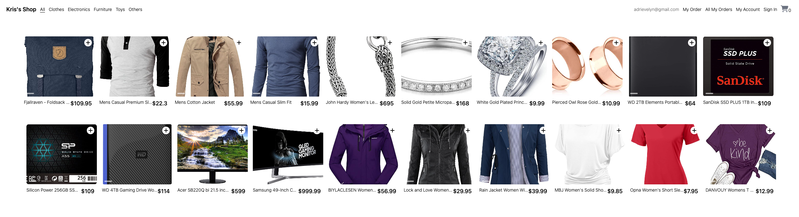
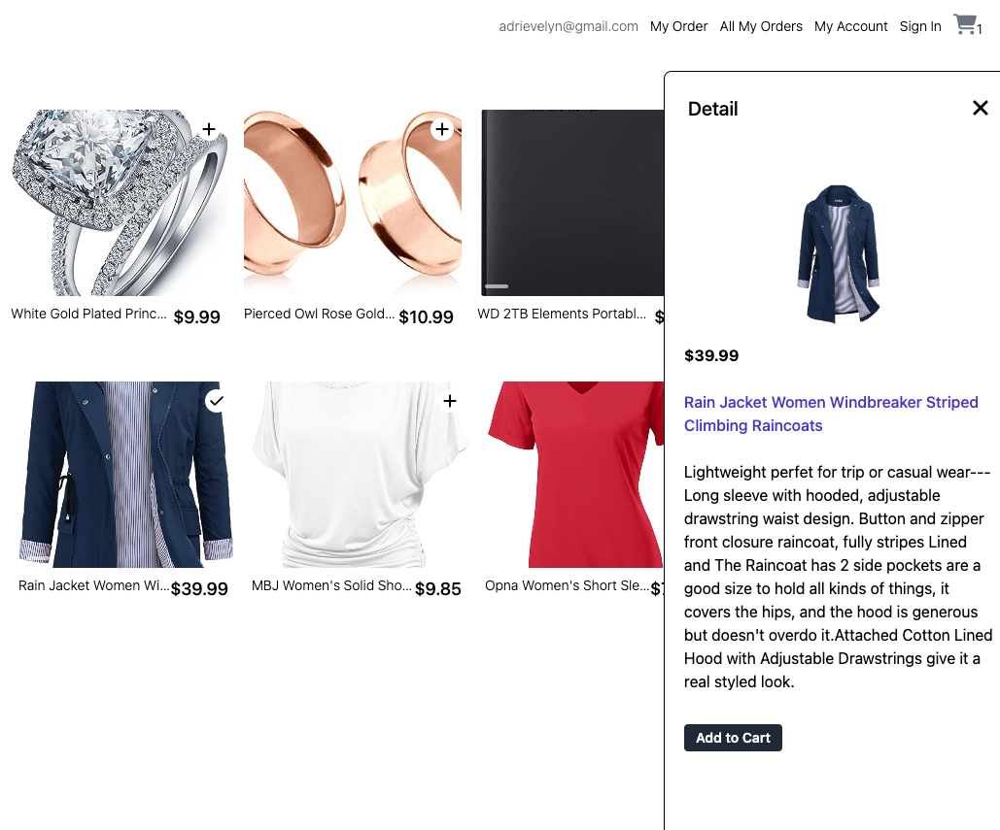
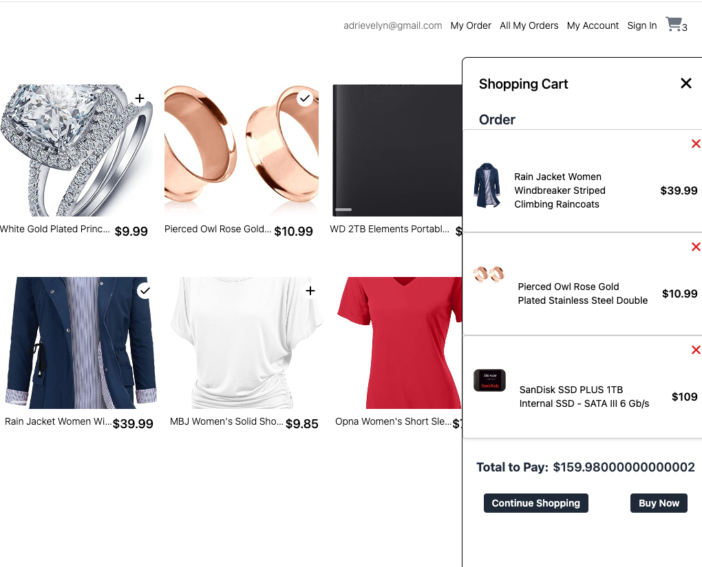

# React + Vite
# Adri's Shop

Discover a world of style, luxury, and innovation at our online marketplace – your one-stop destination for fashion, jewelry, electronics, toys, and more. Explore an extensive collection of trendy apparel, exquisite jewelry pieces, cutting-edge electronics, and playful toys, all curated for your discerning taste. Elevate your shopping experience with a diverse range of high-quality products that cater to every lifestyle. From the latest fashion trends to state-of-the-art electronics and delightful toys, our ecommerce platform brings together a curated selection for the modern and savvy shopper. Shop with confidence and convenience, embracing a seamless blend of variety and quality across our diverse product categories.

## Key Features
1. **Intuitive Navigation:** User-friendly interface and intuitive navigation for a seamless shopping experience.

2. **Dynamic Product Catalog:** Engaging presentation of products with detailed images, descriptions, and filtering options.

3. **Interactive Shopping Cart:** Ability to dynamically add, edit, and remove products from the shopping cart.

4. **Secure Checkout Process:** Integration of secure payment gateways for smooth and trustworthy transactions.

5. **User Management:** User registration, secure login, and user profiles to track purchase history and preferences.

6. **Real-Time Notifications:** Instant notifications regarding order status, special offers, and relevant updates.

7. **Responsive Design:** Adaptable to mobile devices and other screen sizes for a consistent experience across all devices.

8. **Review and Rating System:** Allows users to leave reviews and ratings for products, enhancing buyer confidence.

9. **Wishlist Functionality:** Capability for users to create and manage wishlists for future purchases.

## Technology

- [React](https://reactjs.org/)
- [Vite](https://vitejs.dev/)
- [Tailwind CSS](https://tailwindcss.com/)